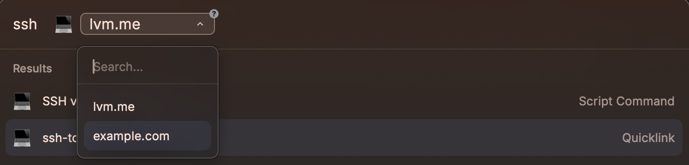

# Script Command Example

[Script Commands](https://manual.raycast.com/script-commands)のサンプル集です！

## Search Google
任意の検索キーワードをRaycastから検索するコマンドです。
URLを入力するとそのURLに飛ぶことができます
[Google Search Extension](https://www.raycast.com/mblode/google-search)だとURLを入力しても検索してしまうので作りました。
deeplinkと組み合わせると英語で選択した文字をそのまま検索することができます。
Quicklinksを[こちら](https://ray.so/quicklinks/shared?quicklinks=%7B%22name%22:%22google-search-en-by-selected%22,%22link%22:%22raycast:%5C/%5C/script-commands%5C/google-search?arguments%3D%7Bselection%7D%26arguments%3Den%22%7D)でシェアします
さらに`option + g`のようにホットキーを組み合わせるのもおすすめです！

## SSH via terminal
指定したhost名に対しSSH接続を試みた状態でTerminalを開くことができるコマンドです

`raycast://script-commands/ssh-via-terminal?arguments={argument name="mode" default="github.com" options="lvm.me, example.com"}`
上記をQuicklinksとして登録することで下記のようにホスト名を登録しておくことができる

[こちら](https://ray.so/quicklinks/shared?quicklinks=%7B%22name%22:%22ssh-to-x%22,%22openWith%22:%22Terminal%22,%22link%22:%22raycast:%5C/%5C/script-commands%5C/ssh-via-terminal?arguments%3D%7Bargument%20name%3D%5C%22mode%5C%22%20default%3D%5C%22github.com%5C%22%20options%3D%5C%22lvm.me,%20example.com%5C%22%7D%22%7D)から取り込むことも可能です